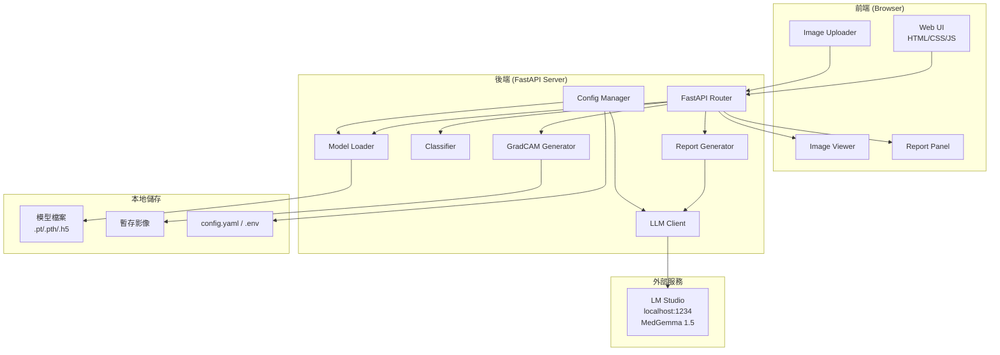
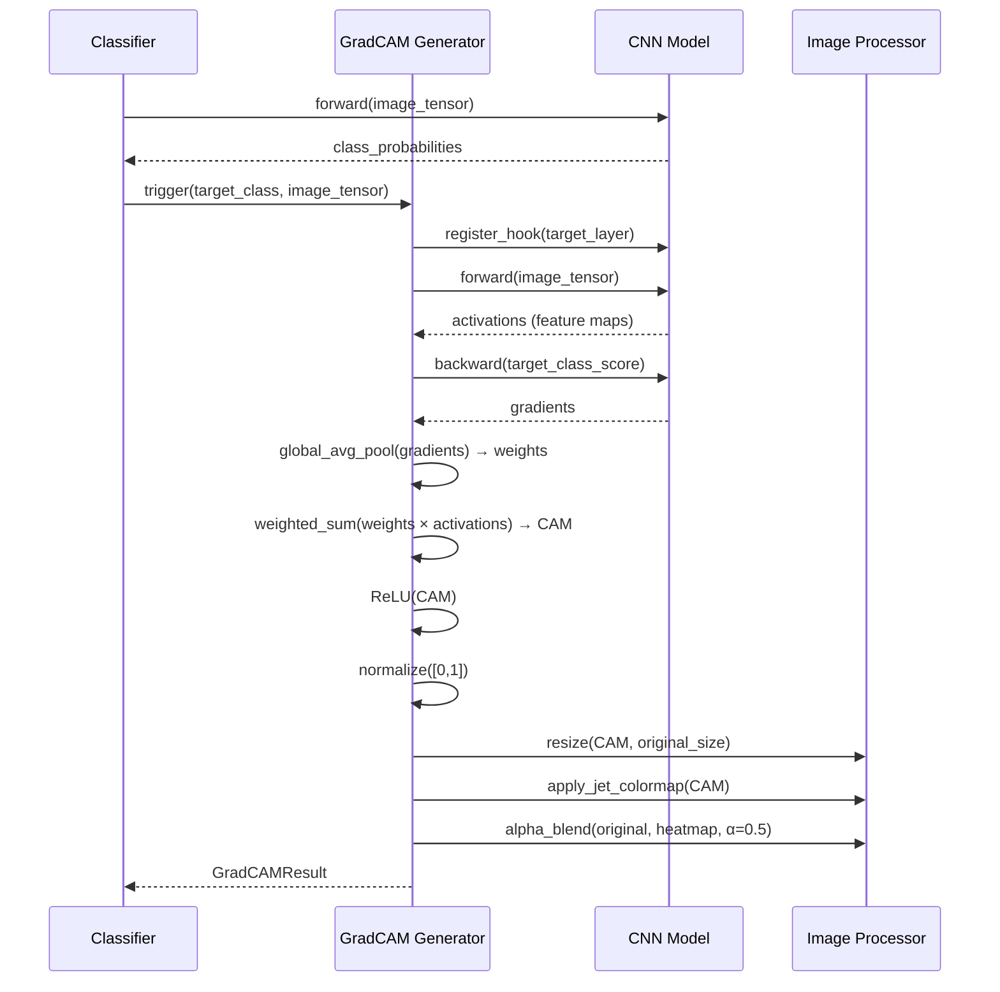

# Design Document：肺癌醫療影像分析系統

## Overview

肺癌醫療影像分析系統（Lung Cancer Medical Image Analysis System）是一套整合 CNN 深度學習模型視覺化與本地 LLM 的醫療輔助診斷 Web 應用程式。系統採用前後端分離架構：後端以 Python FastAPI 提供 REST API，負責模型載入、影像推論、Grad-CAM 熱力圖產生及 LLM 報告生成；前端以純 HTML/CSS/JavaScript 實作深色醫療主題三欄式介面，透過 Fetch API 與後端溝通。

### 設計目標

- **模組化**：各功能元件（Model_Loader、Classifier、GradCAM_Generator、LLM_Client）獨立封裝，便於替換與測試
- **可靠性**：完整的錯誤處理鏈，任一步驟失敗均能優雅降級並回報明確訊息
- **效能**：模型載入後快取於記憶體，避免重複載入；影像處理使用 NumPy/OpenCV 向量化運算
- **可設定性**：透過 config.yaml / .env 集中管理所有外部依賴參數

---

## Architecture

### 系統元件關係圖



### 技術棧

| 層次 | 技術 |
|------|------|
| 後端框架 | Python 3.10+ / FastAPI / Uvicorn |
| 深度學習 | PyTorch 2.x（主要）/ TensorFlow 2.x / Keras（相容） |
| Grad-CAM | pytorch-grad-cam |
| 影像處理 | Pillow / OpenCV / NumPy |
| LLM 串接 | openai Python SDK（指向本地 LM Studio） |
| 設定管理 | PyYAML / python-dotenv / Pydantic Settings |
| 前端 | HTML5 / CSS3 / Vanilla JavaScript |
| PDF 匯出 | reportlab（後端產生）或 jsPDF（前端產生） |

---

## Components and Interfaces

### 後端元件

#### 1. Config Manager

負責讀取 `config.yaml` 或 `.env`，提供全域設定物件。

```python
class AppConfig(BaseSettings):
    model_path: str = ""
    lm_studio_url: str = "http://localhost:1234"
    llm_model_name: str = "medgemma-1.5"
    default_target_layer: str = ""
    max_image_size_mb: int = 50
    llm_timeout_seconds: int = 60

    class Config:
        env_file = ".env"
        yaml_file = "config.yaml"
```

#### 2. Model Loader

```python
class ModelLoader:
    def load(self, model_path: str, target_layer: str | None = None) -> LoadedModel
    def _load_pytorch(self, path: str) -> torch.nn.Module
    def _load_keras(self, path: str) -> keras.Model
    def _detect_last_conv_layer(self, model: Any) -> str
    def validate_format(self, path: str) -> bool
```

**LoadedModel 資料結構：**
```python
@dataclass
class LoadedModel:
    model: Any                  # torch.nn.Module 或 keras.Model
    framework: str              # "pytorch" | "keras"
    target_layer_name: str
    target_layer: Any           # 實際層物件（PyTorch）或層名稱（Keras）
```

#### 3. Classifier

```python
class Classifier:
    def predict(self, model: LoadedModel, image_tensor: torch.Tensor) -> ClassificationResult
    def preprocess_image(self, image: PIL.Image) -> torch.Tensor
```

**ClassificationResult 資料結構：**
```python
@dataclass
class ClassificationResult:
    predicted_class: int
    predicted_label: str
    confidence: float
    all_probabilities: list[dict]  # [{"label": str, "probability": float}]
```

#### 4. GradCAM Generator

```python
class GradCAMGenerator:
    def generate(
        self,
        model: LoadedModel,
        image_tensor: torch.Tensor,
        original_image: PIL.Image,
        target_class: int | None = None
    ) -> GradCAMResult

    def _apply_colormap(self, cam: np.ndarray) -> np.ndarray
    def _overlay(self, original: np.ndarray, heatmap: np.ndarray, alpha: float = 0.5) -> np.ndarray
```

**GradCAMResult 資料結構：**
```python
@dataclass
class GradCAMResult:
    cam_array: np.ndarray          # 正規化後的 CAM [0,1]
    heatmap_rgb: np.ndarray        # jet colormap 彩色熱力圖
    overlay_image: PIL.Image       # 疊加後的 Heatmap_Overlay
    overlay_base64: str            # Base64 編碼供前端顯示
```

#### 5. LLM Client

```python
class LLMClient:
    def __init__(self, config: AppConfig)
    def generate_report(self, prompt: str) -> str
    def _build_client(self) -> openai.OpenAI
```

#### 6. Report Generator

```python
class ReportGenerator:
    def generate(
        self,
        classification: ClassificationResult,
        gradcam_result: GradCAMResult,
        image_metadata: dict
    ) -> StructuredReport

    def _build_prompt(self, ...) -> str
    def _parse_report(self, raw_text: str) -> StructuredReport
```

**StructuredReport 資料結構：**
```python
@dataclass
class StructuredReport:
    findings: str
    impression: str
    recommendation: str
    raw_text: str
    generated_at: datetime
```

### 前端元件

```
App (index.html)
├── Header
│   └── SystemTitle + Logo
├── MainLayout (三欄 CSS Grid)
│   ├── LeftPanel (25%)
│   │   ├── ImageUploader
│   │   │   ├── DropZone
│   │   │   └── ImagePreview
│   │   ├── ModelSettings
│   │   │   ├── ModelPathInput
│   │   │   └── TargetLayerInput
│   │   └── AnalyzeButton
│   ├── CenterPanel (45%)
│   │   ├── ProgressIndicator
│   │   ├── ImageViewer
│   │   │   ├── OriginalImageCard
│   │   │   └── HeatmapOverlayCard
│   │   └── ClassificationResults
│   │       └── ConfidenceProgressBars
│   └── RightPanel (30%)
│       ├── ReportPanel
│       │   ├── FindingsSection
│       │   ├── ImpressionSection
│       │   └── RecommendationSection
│       └── ExportButtons
│           ├── ExportPDFButton
│           └── ExportTextButton
└── ErrorToast
```

---

## Data Models

### API 請求 / 回應模型

#### POST /api/upload-image
```
Request:  multipart/form-data { file: File }
Response: {
  "image_id": "uuid",
  "filename": "string",
  "preview_base64": "string",
  "width": int,
  "height": int,
  "size_bytes": int
}
```

#### POST /api/load-model
```
Request:  { "model_path": "string", "target_layer": "string | null" }
Response: {
  "model_id": "uuid",
  "framework": "pytorch | keras",
  "target_layer": "string",
  "layer_names": ["string"]
}
```

#### POST /api/analyze
```
Request:  {
  "image_id": "string",
  "model_id": "string",
  "target_class": "int | null"
}
Response: {
  "classification": {
    "predicted_class": int,
    "predicted_label": "string",
    "confidence": float,
    "all_probabilities": [{"label": "string", "probability": float}]
  },
  "gradcam": {
    "overlay_base64": "string",
    "download_url": "string"
  },
  "report": {
    "findings": "string",
    "impression": "string",
    "recommendation": "string",
    "generated_at": "ISO8601"
  }
}
```

#### GET /api/download/heatmap/{image_id}
```
Response: image/png binary
```

#### POST /api/export-report
```
Request:  { "report": StructuredReport, "format": "pdf | txt" }
Response: application/pdf 或 text/plain binary
```

#### GET /api/health
```
Response: { "status": "ok", "llm_reachable": bool, "model_loaded": bool }
```

### 前端狀態模型

```javascript
const AppState = {
  uploadedImage: null,      // { id, filename, previewBase64, width, height }
  loadedModel: null,        // { id, framework, targetLayer, layerNames }
  analysisResult: null,     // { classification, gradcam, report }
  currentStep: null,        // null | "classifying" | "generating_cam" | "generating_report"
  error: null,              // string | null
  isAnalyzing: false
};
```

---

## Grad-CAM 演算法實作細節

### 演算法流程



### PyTorch 實作（使用 pytorch-grad-cam）

```python
from pytorch_grad_cam import GradCAM
from pytorch_grad_cam.utils.image import show_cam_on_image
import cv2
import numpy as np

def generate_gradcam(
    model: torch.nn.Module,
    target_layer: torch.nn.Module,
    input_tensor: torch.Tensor,
    original_image_np: np.ndarray,  # float32, [0,1], HWC
    target_class: int | None = None
) -> GradCAMResult:
    target_layers = [target_layer]
    targets = [ClassifierOutputTarget(target_class)] if target_class is not None else None

    with GradCAM(model=model, target_layers=target_layers) as cam:
        grayscale_cam = cam(input_tensor=input_tensor, targets=targets)
        grayscale_cam = grayscale_cam[0]  # shape: (H, W)

    # jet colormap 疊加
    overlay = show_cam_on_image(original_image_np, grayscale_cam, use_rgb=True)

    return GradCAMResult(
        cam_array=grayscale_cam,
        heatmap_rgb=cv2.applyColorMap(
            np.uint8(255 * grayscale_cam), cv2.COLORMAP_JET
        ),
        overlay_image=PIL.Image.fromarray(overlay),
        overlay_base64=image_to_base64(overlay)
    )
```

### 最後卷積層自動偵測（PyTorch）

```python
def detect_last_conv_layer(model: torch.nn.Module) -> torch.nn.Module:
    last_conv = None
    for module in model.modules():
        if isinstance(module, (torch.nn.Conv2d, torch.nn.Conv3d)):
            last_conv = module
    if last_conv is None:
        raise ValueError("No convolutional layer found in model")
    return last_conv
```

---

## LLM Prompt 設計

### System Prompt

```
You are MedGemma, an expert medical AI assistant specializing in lung cancer pathology and radiology.
You analyze medical images and provide structured clinical reports.
Always respond in the following exact format:

FINDINGS:
[Detailed description of observable features in the image, including tissue morphology,
cellular patterns, and areas highlighted by the Grad-CAM analysis]

IMPRESSION:
[Clinical interpretation of the findings, including likely diagnosis and confidence level]

RECOMMENDATION:
[Suggested next steps, additional tests, or clinical actions]

Be precise, professional, and use standard medical terminology.
Do not include any text outside of these three sections.
```

### User Prompt 模板

```python
def build_user_prompt(
    classification: ClassificationResult,
    image_metadata: dict
) -> str:
    probs_text = "\n".join([
        f"  - {p['label']}: {p['probability']*100:.1f}%"
        for p in classification.all_probabilities
    ])
    return f"""
Medical Image Analysis Request

Image Information:
- Type: Lung cancer pathology/CT image
- Dimensions: {image_metadata['width']}x{image_metadata['height']} pixels
- Filename: {image_metadata['filename']}

CNN Classification Results:
- Predicted Class: {classification.predicted_label}
- Confidence: {classification.confidence*100:.1f}%
- All Class Probabilities:
{probs_text}

Grad-CAM Analysis:
- The Grad-CAM heatmap highlights regions the model focused on for classification.
- High-activation areas (red/yellow in jet colormap) indicate regions most influential
  for the predicted class.

Please provide a structured medical report based on the above analysis.
"""
```

---

## Error Handling

### 錯誤分類與處理策略

| 錯誤類型 | 觸發條件 | 處理方式 | 前端顯示 |
|----------|----------|----------|----------|
| `ImageFormatError` | 非 JPEG/PNG/TIFF 格式 | 400 Bad Request | 紅色 Toast：「不支援的格式，請上傳 JPEG、PNG 或 TIFF」 |
| `ImageSizeError` | 檔案 > 50MB | 400 Bad Request | 紅色 Toast：「檔案過大，上限為 50MB」 |
| `ModelFormatError` | 非 .pt/.pth/.h5 格式 | 400 Bad Request | 紅色 Toast：「不支援的模型格式」 |
| `ModelLoadError` | 模型載入失敗 | 500 Internal Server Error | 紅色 Toast：詳細錯誤訊息 |
| `NoConvLayerError` | 模型無卷積層 | 422 Unprocessable Entity | 紅色 Toast：「模型中未找到卷積層」 |
| `InferenceError` | 推論過程例外 | 500 Internal Server Error | 步驟指示器標紅 + Toast |
| `GradCAMError` | Grad-CAM 計算失敗 | 500 Internal Server Error | 步驟指示器標紅 + Toast |
| `LLMConnectionError` | 無法連線 LM Studio | 503 Service Unavailable | 紅色 Toast：「無法連線至 LM Studio，請確認服務是否啟動」 |
| `LLMTimeoutError` | 60 秒逾時 | 504 Gateway Timeout | 紅色 Toast：「報告產生逾時（60s），請重試」 |
| `ConfigError` | 設定檔路徑不存在 | 啟動時 stderr + 退出 | N/A（啟動失敗） |

### 後端錯誤回應格式

```python
class ErrorResponse(BaseModel):
    error_code: str
    message: str
    detail: str | None = None
    timestamp: datetime
```

### 前端錯誤處理流程

```javascript
async function runAnalysis() {
    try {
        updateStep("classifying");
        const classResult = await apiCall("/api/analyze", payload);
        updateStep("generating_cam");
        // ... 後續步驟
    } catch (error) {
        stopAllSteps();
        showErrorToast(error.message);
        enableReanalyzeButton();
    }
}
```

---

## Testing Strategy

### 測試層次

#### 1. 單元測試（Unit Tests）

針對各後端元件的純函式邏輯：

- **Config Manager**：設定讀取、預設值套用、缺少欄位處理
- **Model Loader**：格式驗證、最後卷積層偵測邏輯
- **Classifier**：影像前處理、機率輸出格式
- **GradCAM Generator**：CAM 正規化、colormap 套用、alpha 疊加
- **Report Generator**：Prompt 組合、報告解析（FINDINGS/IMPRESSION/RECOMMENDATION 分段）
- **LLM Client**：逾時處理、連線失敗處理

#### 2. 屬性測試（Property-Based Tests）

使用 **Hypothesis** 函式庫，針對具有普遍性質的邏輯進行隨機輸入測試（最少 100 次迭代）。

詳見「Correctness Properties」章節。

每個屬性測試標記格式：
```python
# Feature: lung-cancer-analysis-report, Property {N}: {property_text}
@given(...)
@settings(max_examples=100)
def test_property_N_title(...)
```

#### 3. 整合測試（Integration Tests）

- **API 端點測試**：使用 FastAPI TestClient 測試各端點的請求/回應格式
- **LLM 串接測試**：Mock LM Studio API，驗證請求格式與逾時行為
- **完整流程測試**：使用測試影像與測試模型執行端對端流程

#### 4. 前端測試

- **手動測試**：響應式佈局在不同視窗寬度的顯示
- **瀏覽器相容性**：Chrome、Firefox、Edge 最新版本

### 測試工具

| 工具 | 用途 |
|------|------|
| pytest | 後端單元測試與整合測試框架 |
| Hypothesis | 屬性測試（PBT）函式庫 |
| FastAPI TestClient | API 端點測試 |
| pytest-mock / unittest.mock | Mock 外部依賴 |
| pytest-cov | 測試覆蓋率報告 |

---

## Directory Structure

```
lung-cancer-analysis-report/
├── backend/
│   ├── main.py                    # FastAPI 應用程式入口
│   ├── config.py                  # AppConfig (Pydantic Settings)
│   ├── routers/
│   │   ├── __init__.py
│   │   ├── image.py               # /api/upload-image, /api/download/heatmap
│   │   ├── model.py               # /api/load-model
│   │   ├── analysis.py            # /api/analyze
│   │   └── report.py              # /api/export-report
│   ├── services/
│   │   ├── __init__.py
│   │   ├── model_loader.py        # ModelLoader
│   │   ├── classifier.py          # Classifier
│   │   ├── gradcam_generator.py   # GradCAMGenerator
│   │   ├── llm_client.py          # LLMClient
│   │   └── report_generator.py    # ReportGenerator
│   ├── models/
│   │   ├── __init__.py
│   │   └── schemas.py             # Pydantic 資料模型
│   ├── utils/
│   │   ├── __init__.py
│   │   ├── image_utils.py         # 影像處理工具函式
│   │   └── file_utils.py          # 檔案操作工具函式
│   └── tests/
│       ├── __init__.py
│       ├── unit/
│       │   ├── test_model_loader.py
│       │   ├── test_classifier.py
│       │   ├── test_gradcam_generator.py
│       │   ├── test_report_generator.py
│       │   └── test_llm_client.py
│       ├── property/
│       │   └── test_properties.py  # Hypothesis 屬性測試
│       └── integration/
│           ├── test_api_endpoints.py
│           └── test_full_pipeline.py
├── frontend/
│   ├── index.html
│   ├── css/
│   │   ├── main.css               # 全域樣式、CSS 變數
│   │   ├── layout.css             # 三欄式佈局、響應式
│   │   ├── components.css         # 卡片、按鈕、進度條等元件
│   │   └── theme.css              # 深色醫療主題色彩定義
│   └── js/
│       ├── app.js                 # 主應用程式邏輯、狀態管理
│       ├── api.js                 # API 呼叫封裝
│       ├── ui.js                  # DOM 操作、UI 更新函式
│       └── export.js              # PDF / 純文字匯出
├── config.yaml                    # 系統設定檔範本
├── .env.example                   # 環境變數範本
├── requirements.txt               # Python 依賴
└── README.md
```

---

## Correctness Properties


*A property is a characteristic or behavior that should hold true across all valid executions of a system — essentially, a formal statement about what the system should do. Properties serve as the bridge between human-readable specifications and machine-verifiable correctness guarantees.*

### Property 1：影像格式驗證拒絕非支援格式

*For any* 檔案副檔名字串，影像格式驗證函式應當且僅當副檔名為 `.jpg`、`.jpeg`、`.png`、`.tiff`、`.tif`（不區分大小寫）時回傳 `True`，對所有其他副檔名回傳 `False`。

**Validates: Requirements 1.1, 1.3**

---

### Property 2：影像大小驗證拒絕超過上限的檔案

*For any* 非負整數檔案大小（bytes），大小驗證函式應當且僅當檔案大小超過 50 × 1024 × 1024 bytes 時回傳驗證失敗，對所有不超過上限的大小回傳驗證通過。

**Validates: Requirements 1.4**

---

### Property 3：模型格式驗證拒絕非支援格式

*For any* 檔案路徑字串，模型格式驗證函式應當且僅當副檔名為 `.pt`、`.pth`、`.h5`（不區分大小寫）時回傳 `True`，對所有其他副檔名回傳 `False`。

**Validates: Requirements 2.3, 2.4**

---

### Property 4：最後卷積層自動偵測永遠回傳最後一個 Conv2d

*For any* 包含至少一個 `torch.nn.Conv2d` 層的 PyTorch 模型，`detect_last_conv_layer` 函式回傳的層應等同於模型中按深度優先順序遍歷所得的最後一個 `Conv2d` 實例。

**Validates: Requirements 2.6**

---

### Property 5：分類機率總和恆為 1

*For any* 有效的影像輸入張量，Classifier 回傳的 `all_probabilities` 清單中所有機率值的總和應在浮點誤差範圍內等於 1.0（即 `|sum - 1.0| < 1e-5`）。

**Validates: Requirements 3.2**

---

### Property 6：Grad-CAM 正規化輸出恆在 [0, 1] 範圍內

*For any* 任意形狀與數值範圍的原始 CAM 陣列（包含全零、全相同值、含負數等邊界情況），正規化函式的輸出陣列中所有元素值應滿足 `0.0 ≤ value ≤ 1.0`。

**Validates: Requirements 4.2**

---

### Property 7：熱力圖疊加影像尺寸與原始影像一致

*For any* 任意寬度與高度的原始影像，GradCAM_Generator 產生的 `Heatmap_Overlay` 影像的寬度與高度應與原始影像完全相同。

**Validates: Requirements 4.3, 4.4**

---

### Property 8：Prompt 必定包含分類標籤與信心分數

*For any* 有效的 `ClassificationResult` 物件（包含任意 `predicted_label` 字串與任意 `[0,1]` 範圍的 `confidence` 值），`ReportGenerator._build_prompt` 產生的提示詞字串應同時包含 `predicted_label` 的文字內容與 `confidence` 的數值表示。

**Validates: Requirements 5.1**

---

### Property 9：報告解析器正確提取三段式結構

*For any* 包含 `FINDINGS:`、`IMPRESSION:`、`RECOMMENDATION:` 三個段落標題的 LLM 回應文字（各段落內容為任意非空字串），`ReportGenerator._parse_report` 解析後的 `StructuredReport` 物件中，`findings`、`impression`、`recommendation` 三個欄位均應為非空字串，且其內容應對應原始文字中各段落標題後的內容。

**Validates: Requirements 5.3**

---

### Property 10：缺少設定欄位時系統使用預設值

*For any* 設定欄位的任意子集（即部分欄位缺失的設定輸入），`AppConfig` 初始化後的物件應對所有缺失欄位套用預定義的預設值，且 `lm_studio_url` 的預設值應為 `"http://localhost:1234"`，整體設定物件應為有效且可使用的狀態。

**Validates: Requirements 8.2, 8.4**
